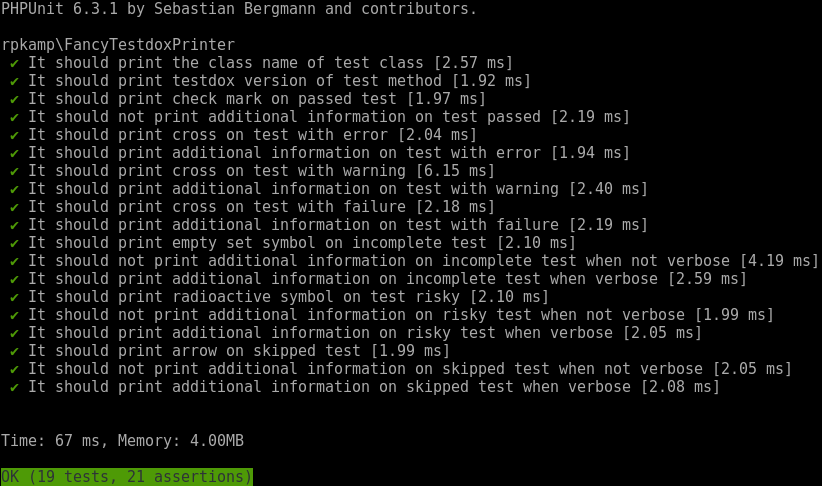
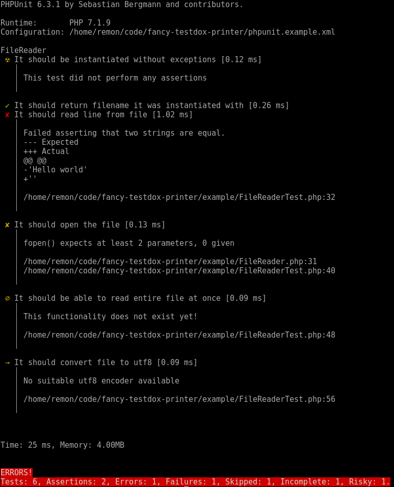

# Fancy Testdox Printer [](https://travis-ci.org/rpkamp/fancy-testdox-printer)

A fancy testdox printer for PHPUnit. Output is similar to PHPUnit's `--testdox` output, but:

- Tests are more clearly marked as failing/passing by colored<sup>1</sup> symbols
- Failures/errors etc are shown inline instead of at the end of the test run for more clear and early feedback

## Legend

| Symbol | Color | Meaning |
| --- | --- | --- |
| ✔ | green | test passed |
| ✘ | red | assertion failed |
| ✘ | yellow | PHPUnit error or warning |
| ∅ | yellow | incomplete test |
| ☢ | yellow | risky test |
| → | yellow | skipped test |

## Installation
On the command line run

```
composer require rpkamp/fancy-testdox-printer --dev
```

to install this package as a development dependency

## Usage
To use this printer you can either pass a command line argument to PHPUnit or edit `phpunit.xml`

### Command line
On the command line run

```
vendor/bin/phpunit --printer "rpkamp\FancyTestdoxPrinter"
```

### phpunit.xml
In `phpunit.xml` add `printerClass="rpkamp\FancyTestdoxPrinter"` to the `phpunit` tag (see [`phpunit.xml`][phpunitxml] for an example).

## Example output

The output of the test suite for this project using itself as a printer looks as follows:



(run `vendor/bin/phpunit` to obtain this output)

A possible output with failures, errors, etc looks as follows:



(run `vendor/bin/phpunit --configuration phpunit.example.xml -v` to obtain this output)

Note that without `-v` the risky, incomplete and skipped tests don't print additional information

[phpunitxml]: https://github.com/rpkamp/fancy-testdox-printer/blob/master/phpunit.xml

<sup>1</sup> In case your terminal supports this and you have it enabled in PHPUnit
